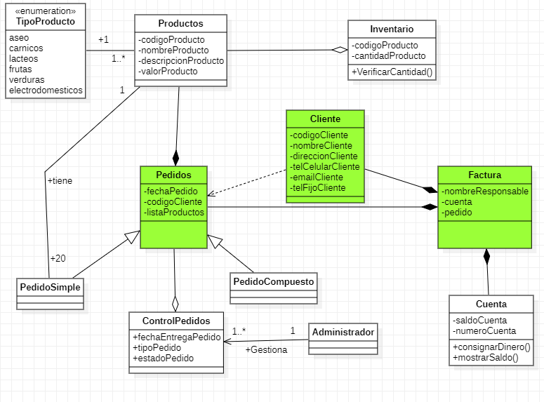
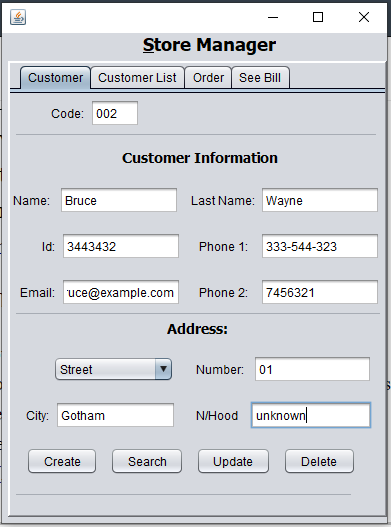
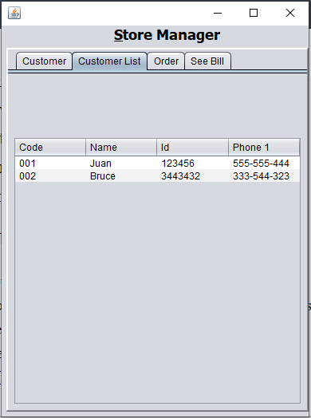
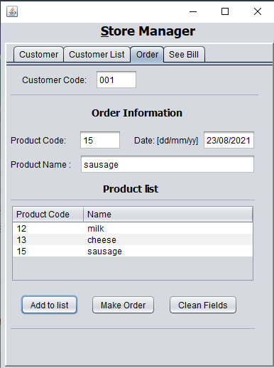
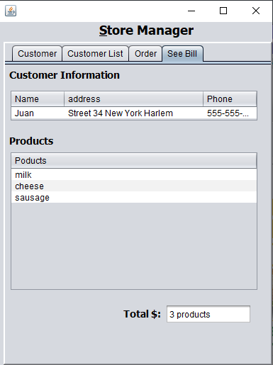

# Gestion Pedidos

This repository contains a order manager that handles customers, bills and orders. This challenge aimed to a MVC model although in this cases as the information store is not persistent for the moment, the model will be neglected then.This repo just contain the view, and a controller that manage the buttons and call the following classes highlighted in green.

# view
The view contains the followings tabs

<h2>Customer Tag</h2>

This tab is a form which will be used to get the information about customers, and, with this form is possible to performing all operations of the CRUD.

<h2>Customer List Tag</h2>

This tab just show the information about customer created in the customer tab

<h2>Order Tag</h2>

This tab is a form which will be used to set the information about the bill, the customer must be created before making the order otherwise a popping up windows will show a error message. The way to add a product is filling the fields out and then hitting the add list button. To assign a product to a customer the way is hitting the make order button. 

<h2>See Bill Tag</h2>

This tab show the information about the customer and their respective order, in other words this tab show the information that has a common grocery bill.

