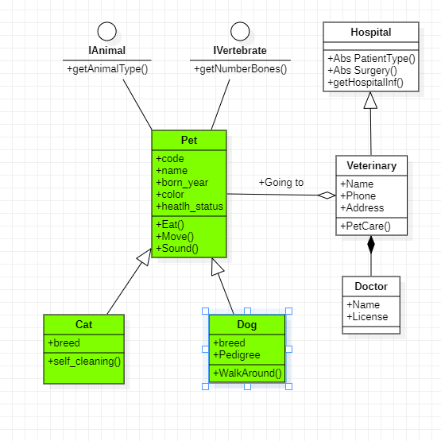

# Pet Manager

This repository contains a graphic interface to maninipulate information about a veterinary clinic, the main class is clase pet, that is inherited by clsDog and clsCat which are two classes used by the GUI to store the information in vectors (not persistence storage).

The class diagram is depicted in the following image, the green classes are the ones implemeted by the GUI.

# Pet list tab

Show the information inputted in both cat and dog managers

# Cat Manager Tab

Contains the form with fields that are needed to fill out the information about the cats and also has the buttons needed to performing the CRUD of the cat manager tag

# Dog Manager Tab

Contains the form with fields that are needed to fill out the information about the dogs and also has the buttons needed to performing the CRUD of the dog manager tag

