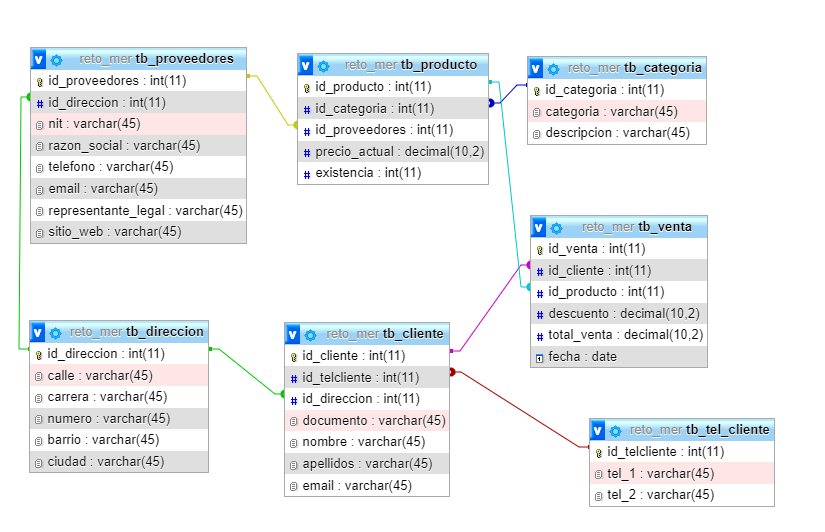

# SQL

Contains the creation of a relational database in MySQL whit a few operation of the CRUD, this data base will be used as a database for retains the information about 'Gestion de pedidos' the design of this data base is show in the following picture

