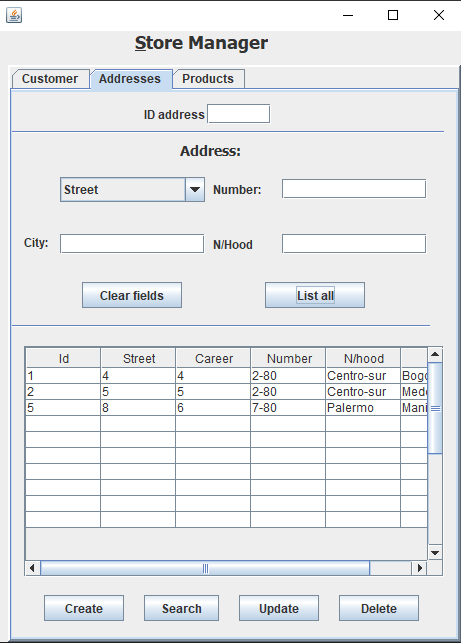

# SpringBoot

This repo contains a MVC model using springboot crudRepository what is a library of springboot used for making easier the way to connecting Java to SQL server

The code is divided in the followings parts

<h2>Repositories</h2>

Contains abstract classes that are needed to connect the view whit the model.

<h2>Modelo</h2>

Contains the classes with its setter and getter needed to connect the database with Java. The decorators '@Table' '@Id' '@Column' is the notation required by SpringBoot as a convention to use the crudRepository. The model will be used by the controller to connect the view whit the model.

<h2>Controlador</h2>

The controller is one of the most important chunks of this software, because this one will allow us to connect the database with the GUI what is contained in the vista packet.The controller also make use of the packet repositories, with the purpose to create a instance of such interface and leverage all tools allocated in crudRepository library.

<h2>vista</h2>

This packet contain the GUI it's mean have all graphical interface the user will see and interact.
The view contains 3 tabs that will be summarize as a follow.

<h3>Customer Tab</h3>

Basically is divided into 3 parts,the first part contain a box what will allows 'Search', 'update' or 'delete' a customer, for creating a Customer is not allowed fill out the code because the database is created with autoincrement what means the database will assign the id automatically, 'Clear Fields' is used for cleaning the boxes and 'ListAll' it's used to listing the show all record of the database in the table.

<h3>Addresses Tab</h3>

Is similar to the customer tab and whit the same buttons but this part is related with customer address and the primary key of this chunk is the foreign key of the customer information 

<h3>Products Tab</h3>

Same design that the previous tabs but this one contains information about products

